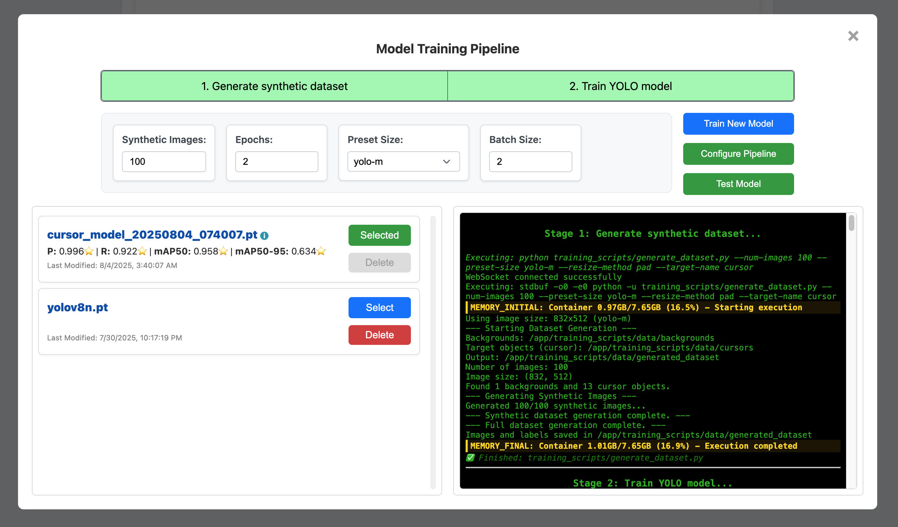

# Model Training Module

A containerized YOLO model training system with real-time monitoring, configurable pipelines, and a modern web interface. Train custom object detection models with live feedback and professional-grade tooling.

[](https://www.patreon.com/aikeymouse)

## 🚀 Quick Overview

**What it does:** Train YOLO models through a web interface with real-time output streaming and configurable multi-stage pipelines.

**Key Technologies:** Docker Compose, Go backend, Python FastAPI, WebSocket communication, PTY-based output streaming.

**Perfect for:** Custom object detection, cursor tracking, educational projects, rapid prototyping, and production ML workflows.

## 📁 Project Structure

```
model-training-module/
├── docker-compose.yml          # Multi-service orchestration
├── README.md                   # This overview documentation
├── backend_go/                 # Go HTTP server and WebSocket proxy
│   ├── main.go                # Static file server and WebSocket routing
│   └── Dockerfile             # Go build configuration
├── frontend/                   # Web interface
│   ├── module.html             # Main application interface
│   ├── config/
│   │   ├── training-pipeline.json  # Pipeline configuration
│   │   └── README.md          # 📖 Configuration documentation
│   ├── css/training-module.css # Application styling
│   └── js/                    # Frontend JavaScript modules
└── training_service_python/    # Python training service
    ├── main_v8.py             # FastAPI backend server
    ├── README.md              # 📖 API documentation
    ├── models/                # Model storage directory
    ├── logs/                  # Training execution logs
    ├── training_scripts/      # Core training scripts
    │   └── README.md          # 📖 Training scripts documentation
    └── requirements.txt       # Python dependencies
```

## 📚 Documentation Index

- **[API Reference](training_service_python/README.md)** - Complete FastAPI backend documentation
- **[Training Scripts](training_service_python/training_scripts/README.md)** - Dataset generation and model training guides  
- **[Pipeline Configuration](frontend/config/README.md)** - JSON configuration system documentation

##  Quick Start

### Prerequisites
- Docker and Docker Compose
- 8GB+ RAM (recommended)
- Modern web browser

### Get Started in 2 Minutes

1. **Clone and Start:**
   ```bash
   git clone https://github.com/aikeymouse/model-training-module.git
   cd model-training-module
   docker compose up --build
   cd module_integration/examples/go-example && go run .
   ```

2. **Or Use Pre-built Images (Faster):**
   ```bash
   git clone https://github.com/aikeymouse/model-training-module.git
   cd model-training-module
   cp docker-compose.prod.yml docker-compose.yml
   docker compose up
   cd module_integration/examples/go-example && go run .
   ```

3. **Open Interface:**
   - Navigate to `http://localhost:8080` (Go Example App)
   - Backend API available at `http://localhost:3000`
   - Training service at `http://localhost:3001`
   - Click "Manage Models" to open training interface

4. **Train Your First Model:**
   - Adjust training parameters (epochs, synthetic images)
   - Click "Train New Model"
   - Watch real-time training progress

That's it! Your trained model will be automatically saved and available for testing.

### 📸 Training Interface Preview



*The web interface showing real-time training progress with configurable parameters and live log output.*

## 🔌 System Architecture

### Overview
```
┌─────────────────┐    WebSocket     ┌──────────────────┐    HTTP/WS     ┌─────────────────────┐
│   Web Browser   │ ◄──────────────► │   Go Example     │ ◄────────────► │   Go Backend        │
│                 │                  │  (Port 8080)     │                │  (Port 3000)        │
│ - Training UI   │                  │ - Static Files   │                │ - WebSocket Proxy   │
│ - Real-time Logs│                  │ - Integration    │                │ - API Endpoints     │
└─────────────────┘                  └──────────────────┘                └─────────────────────┘
                                                                                     │ HTTP/WS
                                                                                     ▼
                                                                          ┌─────────────────────┐
                                                                          │  Python Training    │
                                                                          │  Service (Port 3001)│
                                                                          │ - FastAPI           │
                                                                          │ - Model Training    │
                                                                          └─────────────────────┘
```

### Key Technologies
- **PTY-based Output**: True real-time log streaming without buffering
- **WebSocket Proxy**: Go backend routes WebSocket connections to Python service
- **Docker Socket Mounting**: Direct container communication with host Docker daemon
- **Dynamic Configuration**: JSON-based pipeline definitions with variable substitution

### Docker Services
- **backend**: Go HTTP server (static files + WebSocket proxy)
- **training_service**: Python FastAPI (model training + script execution)

## 🎯 Use Cases

- **Custom Object Detection** - Train models for specific domains and use cases
- **Cursor Tracking** - Specialized models for UI automation and screen interaction  
- **Educational Projects** - Learn YOLO training with visual feedback and real-time monitoring
- **Rapid Prototyping** - Quick model iteration and testing with immediate results
- **Production ML Workflows** - Standardized training pipelines for teams and automation
- **Research & Development** - Systematic approach to model experimentation

## �️ Customization

### Environment Variables
```bash
# Go Example App configuration
PORT=8080                                    # Port for the Go example app (default: 8080)
TRAINING_SERVICE_URL=http://localhost:3000   # URL of the Go backend service (default: http://localhost:3000)

# Docker service configuration  
PYTHON_SERVICE_URL=http://training_service:3001  # Internal Docker service URL
DEBUG=true                                   # Enable debug logging

# Storage directories (for Docker containers)
MODELS_DIR=/app/models                       # Model storage directory
LOGS_DIR=/app/logs                          # Training execution logs
```

### Custom Pipelines
Modify `frontend/config/training-pipeline.json` to add:
- New training stages and scripts
- Custom variable types and UI controls  
- Project-specific configurations

See the [Pipeline Configuration Guide](frontend/config/README.md) for detailed customization options.

## � Troubleshooting

### Common Issues

| Issue | Quick Fix |
|-------|-----------|
| WebSocket connection failed | Verify `docker compose ps` shows both services running |
| Script execution error | Check script paths in training service container |
| Model loading issues | Verify model file permissions and integrity |

### Debug Commands
```bash
# Check service status
docker compose ps

# View logs
docker compose logs backend
docker compose logs training_service

# Test endpoints
curl http://localhost:3000/api/models
curl http://localhost:3000/config/training-pipeline.json

# Access containers
docker compose exec backend sh
docker compose exec training_service bash
```

### Complete Reset
```bash
docker compose down -v --remove-orphans
docker compose build --no-cache
docker compose up -d
```

For detailed troubleshooting, see the specific documentation:
- [API Issues](training_service_python/README.md#troubleshooting)
- [Configuration Problems](frontend/config/README.md#validation--testing)
- [Training Script Errors](training_service_python/training_scripts/README.md#troubleshooting)

## 🤝 Contributing

[](https://www.patreon.com/aikeymouse)

Support the development of advanced ML/AI tools and automation frameworks! Your contribution helps maintain and expand this project.

We welcome contributions! Here's how to get started:

### Development Setup
```bash
git clone https://github.com/aikeymouse/model-training-module.git
cd model-training-module
git checkout -b feature/your-feature
docker compose up --build
```

### Guidelines
- **Go Backend**: Follow `gofmt` standards and add proper error handling
- **Python Service**: Use PEP 8, type hints, and comprehensive docstrings  
- **Frontend**: Modern ES6+, clear naming, responsive design
- **Configuration**: Validate JSON, provide defaults, maintain compatibility

### Areas for Contribution
- **Multi-Framework Support** - Extend beyond YOLO to support TensorFlow, PyTorch, OpenCV, and other ML frameworks
- **GPU Acceleration** - Add CUDA/GPU support for training and detection (currently CPU-only)
- **Training Data Management** - Web UI for uploading, reviewing, and managing training datasets in the training_scripts/data folder
- **Advanced Model Support** - Integration with various model architectures and AI fine-tuning scripts
- **Cross-Platform Integration** - Support for different platforms and deployment environments
- **Automated Multi-Platform Builds** - GitHub Actions workflow for Intel/AMD64 and ARM64 Docker images
- **Model Versioning** - Model comparison features and version management
- **Performance Optimization** - Training speed improvements and resource optimization
- **Testing & Documentation** - Comprehensive test suites and expanded examples

## 📄 License

MIT License - see [LICENSE](LICENSE) file for details.

**Key Points:**
- ✅ Commercial use permitted
- ✅ Modification and distribution allowed  
- ⚠️ License notice required

## 🙏 Acknowledgments

Built with excellent open-source technologies:
- **[Ultralytics YOLO](https://github.com/ultralytics/ultralytics)** - Object detection framework
- **[FastAPI](https://fastapi.tiangolo.com/)** - Modern Python web framework
- **[Docker](https://www.docker.com/)** - Containerization platform
- **[Go](https://golang.org/)** & **[Python](https://python.org/)** - Core programming languages

---

**Ready to train your own YOLO models?** 🚀  
Start with `docker compose up --build` and open `http://localhost:8080` for the Go example app!